# Waterly

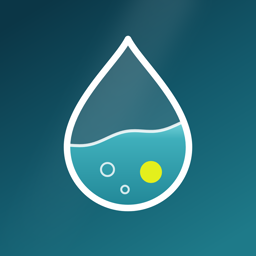

A water intake tracker in Flutter, where the screen itself is the glass.

<p>
  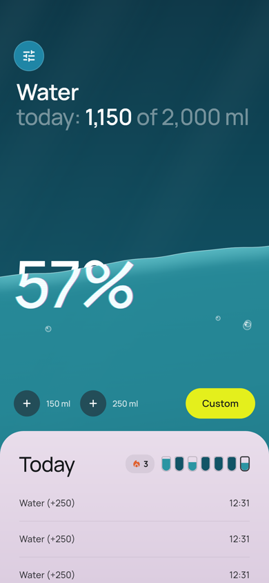
  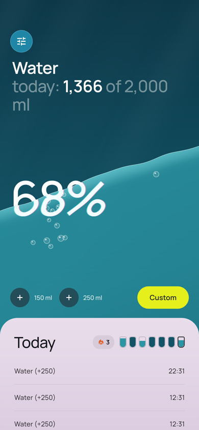
  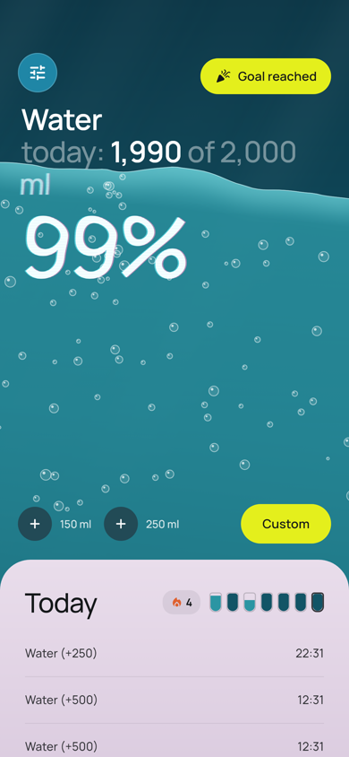
  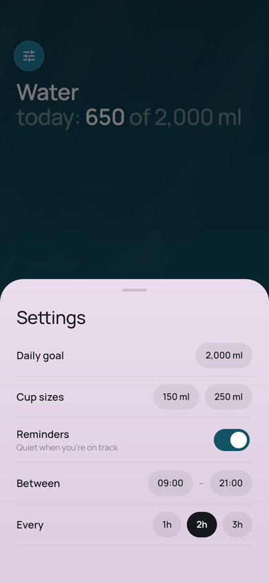
</p>

<p>
  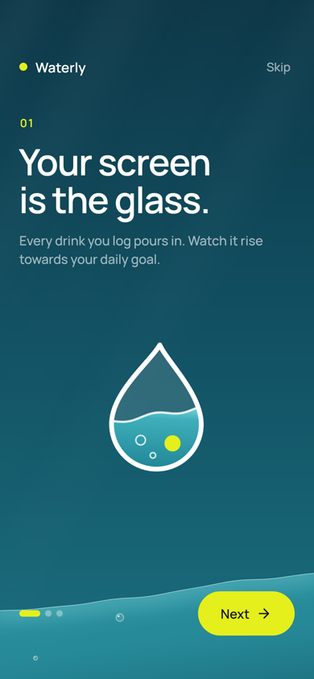
  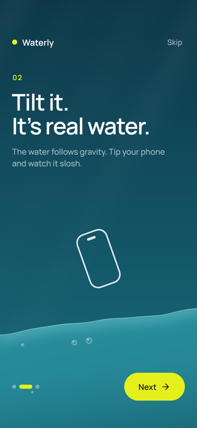
  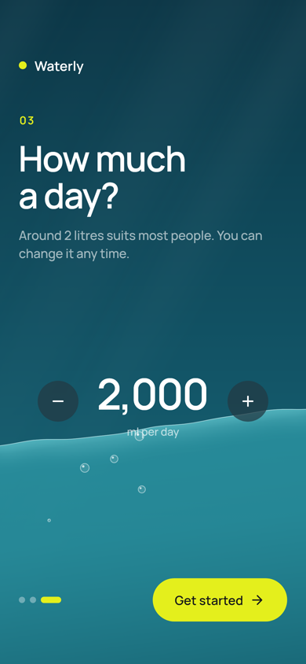
</p>

- **Onboarding.** Three pages over live water that rises as you swipe. The last page sets your daily goal. It only shows on first launch.
- **Water that follows gravity.** It reads the accelerometer, so the surface stays level when you tilt the phone and sloshes back when you stop.
- **Refraction.** The header and the big percentage wobble and pick up a colour fringe wherever the water covers them.
- **Pouring.** Tapping `+150 ml` / `+250 ml` / `Custom` sends up bubbles and ripples. The level rises and the numbers count up.
- **Goal-reached moment.** Hitting 100% makes the water surge and bubble, with a buzz.
- **Today sheet.** Every drink is logged with its time. Pull the sheet up to see more, or swipe an entry left to delete it (you can undo).
- **This week and streak.** Seven tiny glasses next to "Today" show each day's level, plus how many days in a row you've hit your goal.
- **Your own cups.** Long-press `+150` or `+250` to set your mug or bottle size.
- **Gentle reminders.** Off by default. When on, they come every 1–3 hours within the hours you choose, and stay quiet when you've just had a drink, are ahead of pace, or have hit your goal.
- **Home screen widgets (Android).** A 2×2 with today's water and a 4×2 with buttons for your two cups. Tap the widget and the water comes alive for about 8 seconds: it follows the tilt of your phone, sloshes, and pours when you log a drink, then settles back. Drinks logged from the widget show up in the app.
- **Settings** (top-left button): daily goal, cup sizes and reminders. You can also tap the header to change the goal.
- Data is saved on the device and resets each day.

### Widget

<p>
  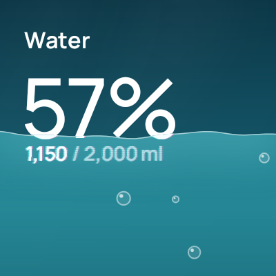
  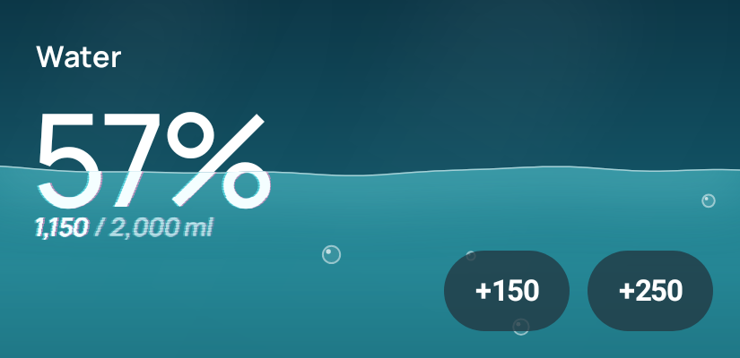
</p>
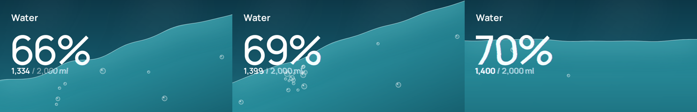

*A live session: tipped and pouring, still sloshing, settled.*

Widgets can't read sensors or animate by themselves. A tap starts a short foreground service (`LiveWaterService`), which Android allows from a widget tap. It reads the accelerometer and sends the widget a new frame about 15 times a second. The water physics and drawing are a Kotlin port of the app's (`android/app/src/main/kotlin/com/kidyoh/waterly/widget/`), and the widget reads and writes the same storage as the app.

## Run it

```bash
flutter pub get
flutter run
```

Tilting only works on a real phone. On an emulator, use its virtual sensors to rotate the device.

To build an APK you can install on an Android phone:

```bash
flutter build apk --release
# -> build/app/outputs/flutter-apk/app-release.apk
```

The release build is signed with the debug key, which is fine for installing it yourself. Publishing to the Play Store needs your own signing key.

## Releases

Download the app from [Releases](https://github.com/Kidyoh/Waterly/releases). To publish a new version, bump `version` in `pubspec.yaml`, add `.github/release-notes/vX.Y.Z.md`, and push. A tag push works too:

```bash
git tag v1.3.0 && git push origin v1.3.0
```

`.github/workflows/release.yml` runs the tests, builds the APKs and publishes the release. To sign with your own key, so each release installs as an update over the last, add the four `ANDROID_*` repository secrets listed at the top of that file. Locally, the same key goes in `android/key.properties`, which is git-ignored.

## Banners

Square launch banners for 1.1 are in `docs/banners/` (2160×2160). They're laid out in `tool/banners/banners.html` around real app screens:

```bash
flutter test tool/render --update-goldens   # app screens for the phone mockups
node tool/banners/render.cjs                 # needs the playwright package
```

## Widget previews

Robolectric renders widget frames with Android's real graphics stack to `android/app/build/widget-previews/`, and checks the storage format shared with the app:

```bash
cd android && ./gradlew :app:testDebugUnitTest
```

## Icon

The icon is drawn in code (`tool/icon/generate_icon_test.dart`). To regenerate it:

```bash
flutter test tool/icon --update-goldens && cp tool/icon/icon_*.png assets/icon/
dart run flutter_launcher_icons
```

## Code

| File | What it does |
| --- | --- |
| `lib/water_sim.dart` | Physics: level and tilt springs, waves, ripples, bubbles, the pour |
| `lib/water_painter.dart` | Draws the scene, including the refracted text |
| `lib/water_screen.dart` | Screen layout, the ticker, the accelerometer |
| `lib/onboarding_screen.dart` | First-launch onboarding and goal picker |
| `lib/water_store.dart` | Entries per day, goal, cups, reminder settings, streak |
| `lib/reminders.dart` | Plans and schedules reminders (`flutter_local_notifications`) |
| `lib/widgets/` | Add buttons, Today sheet, week strip, settings and amount sheets |
| `tool/render/` | Renders app screens to PNG (`flutter test tool/render --update-goldens`) |

Fonts: [Manrope](https://github.com/sharanda/manrope) in the app, plus Instrument Serif in the banners (both SIL Open Font License, see `assets/fonts/OFL.txt` and `tool/banners/fonts/`).
